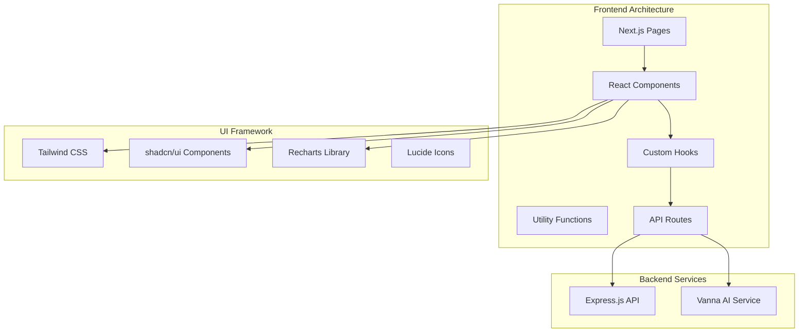

# 🌐 Analytics Dashboard Web App

Modern Next.js frontend application providing an intuitive interface for business intelligence, vendor analytics, and AI-powered data querying.

## 🏗️ Architecture



## 🛠️ Technology Stack

- **Framework**: Next.js 15+ with App Router
- **Language**: TypeScript
- **Styling**: Tailwind CSS
- **UI Components**: shadcn/ui
- **Charts**: Recharts
- **Icons**: Lucide React
- **State Management**: React Hooks (useState, useEffect)
- **HTTP Client**: Fetch API
- **Deployment**: Vercel

## 📁 Project Structure

```
apps/web/
├── app/                          # Next.js App Router
│   ├── layout.tsx               # Root layout
│   ├── page.tsx                 # Home page (redirects to dashboard)
│   ├── globals.css              # Global styles
│   │
│   ├── dashboard/               # Dashboard pages
│   │   ├── layout.tsx          # Dashboard layout with sidebar
│   │   ├── page.tsx            # Main dashboard overview
│   │   ├── chat/               # AI chat interface
│   │   │   └── page.tsx
│   │   └── vendor-analytics/   # Vendor analytics dashboard
│   │       └── page.tsx
│   │
│   └── api/                    # Next.js API routes (proxy to backend)
│       ├── cash-outflow/
│       ├── category-spend/
│       ├── chat/
│       ├── invoice-trends/
│       ├── invoices/
│       ├── stats/
│       ├── vendor-analytics/
│       └── vendors/
│
├── components/                  # React components
│   ├── dashboard/              # Dashboard-specific components
│   │   ├── cash-outflow-chart.tsx
│   │   ├── category-spend-chart.tsx
│   │   ├── invoice-trend-chart.tsx
│   │   ├── invoices-table.tsx
│   │   ├── overview-cards.tsx
│   │   ├── sidebar.tsx
│   │   └── vendor-spend-chart.tsx
│   │
│   └── ui/                     # shadcn/ui components
│       ├── button.tsx
│       ├── card.tsx
│       ├── chart.tsx
│       ├── dialog.tsx
│       ├── input.tsx
│       ├── select.tsx
│       ├── table.tsx
│       ├── tabs.tsx
│       └── ... (40+ UI components)
│
├── hooks/                      # Custom React hooks
│   └── use-mobile.ts
│
├── lib/                        # Utility libraries
│   └── utils.ts               # Utility functions
│
├── public/                     # Static assets
│   ├── favicon.ico
│   └── *.svg                  # Icon files
│
├── package.json
├── next.config.ts             # Next.js configuration
├── tailwind.config.ts         # Tailwind CSS configuration
├── tsconfig.json             # TypeScript configuration
├── vercel.json               # Vercel deployment configuration
└── README.md                 # This file
```

## 🚀 Quick Start

### Prerequisites
- Node.js 18+
- npm or yarn

### Installation
```bash
cd apps/web
npm install
```

### Environment Setup
```bash
cp .env.local.example .env.local
```

Configure your `.env.local` file:
```env
NEXT_PUBLIC_API_URL=http://localhost:8000/api
NEXT_PUBLIC_VANNA_URL=http://localhost:8001
```

### Development
```bash
# Start development server
npm run dev

# Build for production
npm run build

# Start production server
npm start

# Lint code
npm run lint
```

### Access Application
- **Development**: http://localhost:3000
- **Production**: https://your-app.vercel.app

## 🎨 UI Components & Design System

### Design Principles
- **Mobile-First**: Responsive design for all screen sizes
- **Accessibility**: WCAG 2.1 compliant components
- **Consistency**: Unified design language across all pages
- **Performance**: Optimized for fast loading and smooth interactions

### Color Palette
```css
/* Primary Colors */
--primary: 222.2 84% 4.9%        /* Dark blue-gray */
--primary-foreground: 210 40% 98% /* Light text */

/* Secondary Colors */
--secondary: 210 40% 96%          /* Light gray */
--secondary-foreground: 222.2 84% 4.9% /* Dark text */

/* Accent Colors */
--accent: 210 40% 96%             /* Subtle accent */
--accent-foreground: 222.2 84% 4.9%

/* Status Colors */
--success: 142.1 76.2% 36.3%      /* Green */
--warning: 47.9 95.8% 53.1%       /* Yellow */
--error: 0 84.2% 60.2%            /* Red */
```

### Typography Scale
```css
/* Font Sizes */
text-xs: 0.75rem     /* 12px */
text-sm: 0.875rem    /* 14px */
text-base: 1rem      /* 16px */
text-lg: 1.125rem    /* 18px */
text-xl: 1.25rem     /* 20px */
text-2xl: 1.5rem     /* 24px */
text-3xl: 1.875rem   /* 30px */
text-4xl: 2.25rem    /* 36px */
```

## 📊 Dashboard Features

### 🏠 Main Dashboard (`/dashboard`)
Comprehensive overview of key business metrics and KPIs.

**Components:**
- **Overview Cards**: Total invoices, amounts, vendors, pending items
- **Invoice Trends Chart**: Time series analysis with period selection
- **Cash Outflow Chart**: Monthly financial outflow visualization
- **Category Spending Chart**: Expense breakdown by categories
- **Vendor Spending Chart**: Top vendors by total spend
- **Invoices Table**: Recent invoices with pagination and sorting

**Key Features:**
- Real-time data updates
- Interactive charts with tooltips
- Responsive grid layout
- Period filtering (3, 6, 12, 24 months)
- Export capabilities

### 🤖 AI Chat Interface (`/dashboard/chat`)
Natural language querying interface powered by AI.

**Components:**
- **Chat Interface**: Message history with markdown support
- **Query Input**: Natural language input with suggestions
- **Result Display**: Formatted query results with charts
- **Export Options**: CSV/Excel export functionality
- **Session Management**: Persistent chat history

**Key Features:**
- Natural language processing
- Real-time query execution
- Interactive result visualization
- Export to multiple formats
- Session persistence
- Query history and favorites

### 📈 Vendor Analytics (`/dashboard/vendor-analytics`)
Comprehensive vendor relationship analytics and performance metrics.

**Components:**
- **Performance Scorecards**: Multi-dimensional vendor scoring
- **Payment Reliability Charts**: Overdue tracking and analysis
- **Spending Trends**: Interactive time series with vendor selection
- **Risk Assessment**: Risk scoring and categorization
- **Category Analysis**: Spending breakdown by line items

**Key Features:**
- Interactive vendor selection
- Multi-dimensional scoring algorithms
- Risk categorization (Low/Medium/High)
- Growth rate calculations
- Performance benchmarking

## 🧩 Component Library

### Dashboard Components

#### Overview Cards
```typescript
// components/dashboard/overview-cards.tsx
interface OverviewCardsProps {
  data: {
    totalInvoices: number;
    totalAmount: number;
    avgInvoiceValue: number;
    uniqueVendors: number;
    pendingInvoices: number;
    overdueAmount: number;
  };
}

export function OverviewCards({ data }: OverviewCardsProps) {
  // Component implementation
}
```

#### Interactive Charts
```typescript
// components/dashboard/invoice-trend-chart.tsx
interface InvoiceTrendChartProps {
  data: Array<{
    period: string;
    invoiceCount: number;
    totalAmount: number;
    avgAmount: number;
  }>;
  period: string;
  onPeriodChange: (period: string) => void;
}

export function InvoiceTrendChart({ data, period, onPeriodChange }: InvoiceTrendChartProps) {
  // Recharts implementation with interactive features
}
```

#### Data Tables
```typescript
// components/dashboard/invoices-table.tsx
interface InvoicesTableProps {
  data: Invoice[];
  pagination: {
    page: number;
    limit: number;
    total: number;
    pages: number;
  };
  onPageChange: (page: number) => void;
  onSortChange: (field: string, order: 'asc' | 'desc') => void;
}

export function InvoicesTable({ data, pagination, onPageChange, onSortChange }: InvoicesTableProps) {
  // Table implementation with sorting and pagination
}
```

### UI Components (shadcn/ui)

#### Button Component
```typescript
// components/ui/button.tsx
interface ButtonProps extends React.ButtonHTMLAttributes<HTMLButtonElement> {
  variant?: 'default' | 'destructive' | 'outline' | 'secondary' | 'ghost' | 'link';
  size?: 'default' | 'sm' | 'lg' | 'icon';
}

export function Button({ variant = 'default', size = 'default', ...props }: ButtonProps) {
  // Button implementation with variants
}
```

#### Card Component
```typescript
// components/ui/card.tsx
export function Card({ className, ...props }: React.HTMLAttributes<HTMLDivElement>) {
  // Card container implementation
}

export function CardHeader({ className, ...props }: React.HTMLAttributes<HTMLDivElement>) {
  // Card header implementation
}

export function CardContent({ className, ...props }: React.HTMLAttributes<HTMLDivElement>) {
  // Card content implementation
}
```

## 🔗 API Integration

### API Client Setup
```typescript
// lib/api-client.ts
const API_BASE_URL = process.env.NEXT_PUBLIC_API_URL;
const VANNA_BASE_URL = process.env.NEXT_PUBLIC_VANNA_URL;

export async function apiRequest<T>(
  endpoint: string,
  options: RequestInit = {}
): Promise<T> {
  const response = await fetch(`${API_BASE_URL}${endpoint}`, {
    headers: {
      'Content-Type': 'application/json',
      ...options.headers,
    },
    ...options,
  });

  if (!response.ok) {
    throw new Error(`API request failed: ${response.statusText}`);
  }

  return response.json();
}
```

### Data Fetching Patterns
```typescript
// hooks/use-dashboard-data.ts
export function useDashboardData(period: string) {
  const [data, setData] = useState(null);
  const [loading, setLoading] = useState(true);
  const [error, setError] = useState(null);

  useEffect(() => {
    async function fetchData() {
      try {
        setLoading(true);
        const [stats, trends, outflow] = await Promise.all([
          apiRequest('/stats'),
          apiRequest(`/invoice-trends?period=${period}`),
          apiRequest(`/cash-outflow?period=${period}`)
        ]);
        
        setData({ stats, trends, outflow });
      } catch (err) {
        setError(err.message);
      } finally {
        setLoading(false);
      }
    }

    fetchData();
  }, [period]);

  return { data, loading, error, refetch: fetchData };
}
```

### Error Handling
```typescript
// components/error-boundary.tsx
export function ErrorBoundary({ children }: { children: React.ReactNode }) {
  return (
    <ErrorBoundaryComponent
      fallback={({ error, resetErrorBoundary }) => (
        <div className="flex flex-col items-center justify-center min-h-[400px] p-6">
          <AlertTriangle className="h-12 w-12 text-red-500 mb-4" />
          <h2 className="text-lg font-semibold mb-2">Something went wrong</h2>
          <p className="text-gray-600 mb-4 text-center">{error.message}</p>
          <Button onClick={resetErrorBoundary}>Try again</Button>
        </div>
      )}
    >
      {children}
    </ErrorBoundaryComponent>
  );
}
```

## 📱 Responsive Design

### Breakpoint System
```css
/* Tailwind CSS Breakpoints */
sm: 640px   /* Small devices (landscape phones) */
md: 768px   /* Medium devices (tablets) */
lg: 1024px  /* Large devices (laptops) */
xl: 1280px  /* Extra large devices (desktops) */
2xl: 1536px /* 2X large devices (large desktops) */
```

### Mobile-First Approach
```typescript
// Example responsive component
export function ResponsiveGrid({ children }: { children: React.ReactNode }) {
  return (
    <div className="grid grid-cols-1 md:grid-cols-2 lg:grid-cols-3 xl:grid-cols-4 gap-4">
      {children}
    </div>
  );
}
```

### Mobile Navigation
```typescript
// components/dashboard/mobile-nav.tsx
export function MobileNav() {
  const [isOpen, setIsOpen] = useState(false);

  return (
    <div className="md:hidden">
      <Button
        variant="ghost"
        size="icon"
        onClick={() => setIsOpen(!isOpen)}
      >
        <Menu className="h-6 w-6" />
      </Button>
      
      {isOpen && (
        <div className="fixed inset-0 z-50 bg-background/80 backdrop-blur-sm">
          {/* Mobile navigation content */}
        </div>
      )}
    </div>
  );
}
```

## 🎯 Performance Optimization

### Code Splitting
```typescript
// Dynamic imports for large components
const VendorAnalytics = dynamic(() => import('./vendor-analytics/page'), {
  loading: () => <div>Loading vendor analytics...</div>,
  ssr: false
});
```

### Image Optimization
```typescript
// Next.js Image component usage
import Image from 'next/image';

export function OptimizedImage({ src, alt, ...props }) {
  return (
    <Image
      src={src}
      alt={alt}
      width={800}
      height={600}
      placeholder="blur"
      blurDataURL="data:image/jpeg;base64,..."
      {...props}
    />
  );
}
```

### Bundle Analysis
```bash
# Analyze bundle size
npm run build
npx @next/bundle-analyzer
```

## 🔧 Development

### Available Scripts
```bash
# Development
npm run dev              # Start development server
npm run build           # Build for production
npm start              # Start production server

# Code Quality
npm run lint           # Lint TypeScript and React code
npm run lint:fix       # Fix linting issues automatically
npm run type-check     # TypeScript type checking

# Testing
npm test              # Run tests
npm run test:watch    # Run tests in watch mode
npm run test:coverage # Run tests with coverage

# Utilities
npm run clean         # Clean build artifacts
npm run analyze       # Analyze bundle size
```

### Development Workflow
1. **Feature Development**: Create feature branches from main
2. **Component Development**: Build reusable components in isolation
3. **Testing**: Write unit tests for components and utilities
4. **Code Review**: Peer review before merging
5. **Deployment**: Automatic deployment via Vercel

### Code Style Guidelines
```typescript
// Component naming: PascalCase
export function DashboardCard() {}

// Props interface: ComponentNameProps
interface DashboardCardProps {
  title: string;
  value: number;
}

// Custom hooks: use prefix
export function useDashboardData() {}

// Constants: UPPER_SNAKE_CASE
const API_ENDPOINTS = {
  STATS: '/stats',
  INVOICES: '/invoices'
};
```

## 🚀 Production Deployment

### Vercel Configuration
```json
// vercel.json
{
  "version": 2,
  "name": "analytics-dashboard-web",
  "builds": [
    {
      "src": "package.json",
      "use": "@vercel/next"
    }
  ],
  "env": {
    "NEXT_PUBLIC_API_URL": "@analytics-api-url",
    "NEXT_PUBLIC_VANNA_URL": "@analytics-vanna-url"
  }
}
```

### Environment Variables
```bash
# Production environment variables in Vercel
NEXT_PUBLIC_API_URL=https://your-api-domain.com/api
NEXT_PUBLIC_VANNA_URL=https://your-api-domain.com/vanna
```

### Build Optimization
```typescript
// next.config.ts
const nextConfig = {
  experimental: {
    optimizeCss: true,
    optimizePackageImports: ['recharts', 'lucide-react']
  },
  images: {
    domains: ['your-domain.com'],
    formats: ['image/webp', 'image/avif']
  },
  compress: true,
  poweredByHeader: false
};
```

## 🔍 Monitoring & Analytics

### Performance Monitoring
```typescript
// lib/analytics.ts
export function trackPageView(url: string) {
  // Analytics implementation
  if (typeof window !== 'undefined') {
    // Track page views
  }
}

export function trackEvent(eventName: string, properties: Record<string, any>) {
  // Event tracking implementation
}
```

### Error Tracking
```typescript
// lib/error-tracking.ts
export function reportError(error: Error, context?: Record<string, any>) {
  // Error reporting to monitoring service
  console.error('Application Error:', error, context);
}
```

## 🧪 Testing

### Component Testing
```typescript
// __tests__/components/dashboard/overview-cards.test.tsx
import { render, screen } from '@testing-library/react';
import { OverviewCards } from '@/components/dashboard/overview-cards';

const mockData = {
  totalInvoices: 1250,
  totalAmount: 2450000.50,
  avgInvoiceValue: 1960.00,
  uniqueVendors: 85,
  pendingInvoices: 23,
  overdueAmount: 45000.00
};

describe('OverviewCards', () => {
  it('renders all overview cards with correct data', () => {
    render(<OverviewCards data={mockData} />);
    
    expect(screen.getByText('1,250')).toBeInTheDocument();
    expect(screen.getByText('$2,450,001')).toBeInTheDocument();
    expect(screen.getByText('85')).toBeInTheDocument();
  });
});
```

### Integration Testing
```typescript
// __tests__/pages/dashboard.test.tsx
import { render, screen, waitFor } from '@testing-library/react';
import Dashboard from '@/app/dashboard/page';

// Mock API responses
jest.mock('@/lib/api-client', () => ({
  apiRequest: jest.fn()
}));

describe('Dashboard Page', () => {
  it('loads and displays dashboard data', async () => {
    render(<Dashboard />);
    
    await waitFor(() => {
      expect(screen.getByText('Dashboard Overview')).toBeInTheDocument();
    });
  });
});
```

## 🔒 Security

### Content Security Policy
```typescript
// next.config.ts
const securityHeaders = [
  {
    key: 'Content-Security-Policy',
    value: "default-src 'self'; script-src 'self' 'unsafe-eval'; style-src 'self' 'unsafe-inline';"
  },
  {
    key: 'X-Frame-Options',
    value: 'DENY'
  },
  {
    key: 'X-Content-Type-Options',
    value: 'nosniff'
  }
];
```

### Environment Variable Validation
```typescript
// lib/env.ts
const requiredEnvVars = [
  'NEXT_PUBLIC_API_URL',
  'NEXT_PUBLIC_VANNA_URL'
];

export function validateEnvironment() {
  const missing = requiredEnvVars.filter(
    (envVar) => !process.env[envVar]
  );

  if (missing.length > 0) {
    throw new Error(`Missing required environment variables: ${missing.join(', ')}`);
  }
}
```

## 🎨 Customization

### Theme Customization
```typescript
// lib/theme.ts
export const theme = {
  colors: {
    primary: 'hsl(222.2 84% 4.9%)',
    secondary: 'hsl(210 40% 96%)',
    accent: 'hsl(210 40% 96%)',
    success: 'hsl(142.1 76.2% 36.3%)',
    warning: 'hsl(47.9 95.8% 53.1%)',
    error: 'hsl(0 84.2% 60.2%)'
  },
  fonts: {
    sans: ['Inter', 'system-ui', 'sans-serif'],
    mono: ['JetBrains Mono', 'monospace']
  }
};
```

### Component Variants
```typescript
// components/ui/button.tsx
const buttonVariants = cva(
  "inline-flex items-center justify-center rounded-md text-sm font-medium transition-colors",
  {
    variants: {
      variant: {
        default: "bg-primary text-primary-foreground hover:bg-primary/90",
        destructive: "bg-destructive text-destructive-foreground hover:bg-destructive/90",
        outline: "border border-input hover:bg-accent hover:text-accent-foreground",
        secondary: "bg-secondary text-secondary-foreground hover:bg-secondary/80",
        ghost: "hover:bg-accent hover:text-accent-foreground",
        link: "underline-offset-4 hover:underline text-primary"
      },
      size: {
        default: "h-10 py-2 px-4",
        sm: "h-9 px-3 rounded-md",
        lg: "h-11 px-8 rounded-md",
        icon: "h-10 w-10"
      }
    },
    defaultVariants: {
      variant: "default",
      size: "default"
    }
  }
);
```

---

**Analytics Dashboard Web App Documentation last updated: January 2024**
